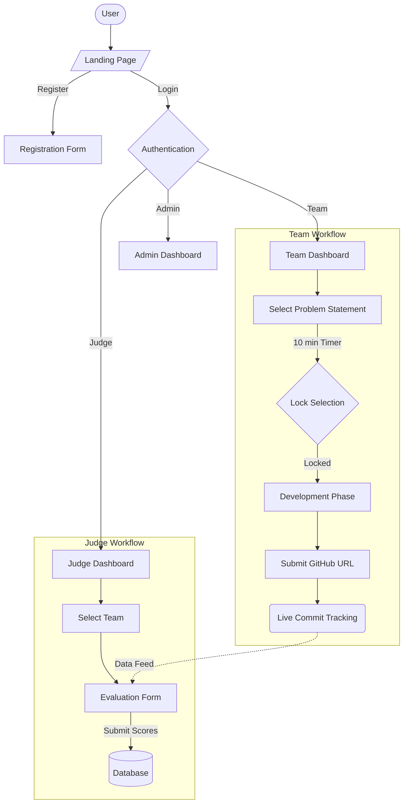
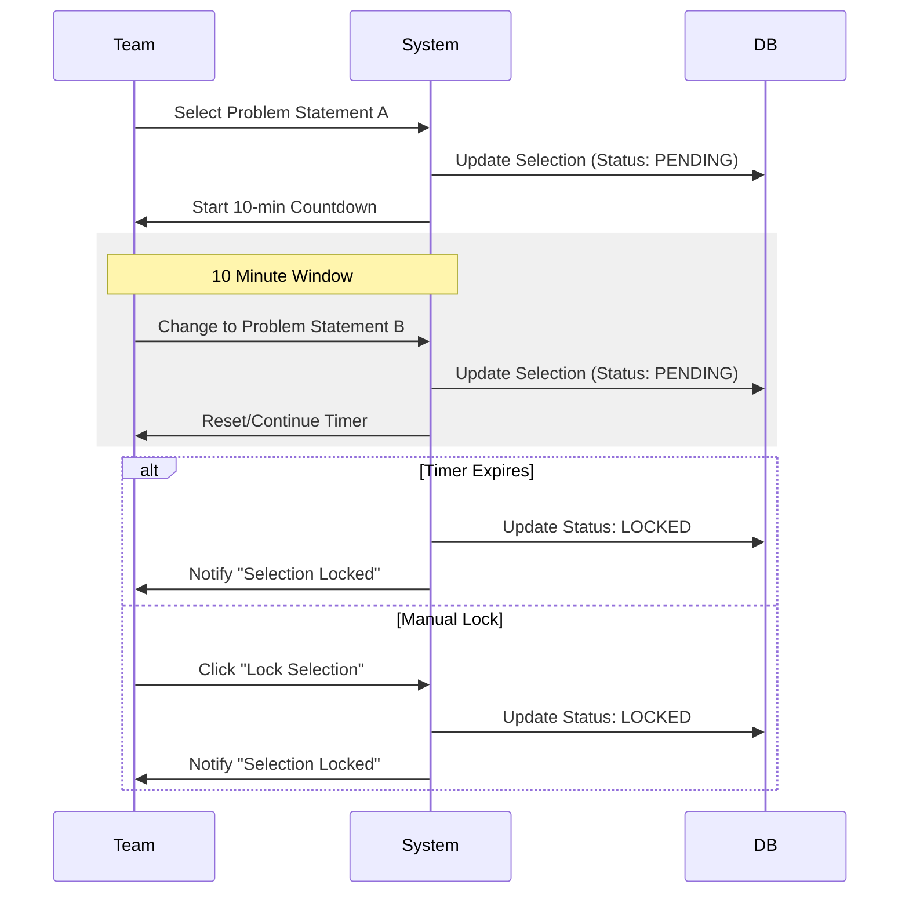
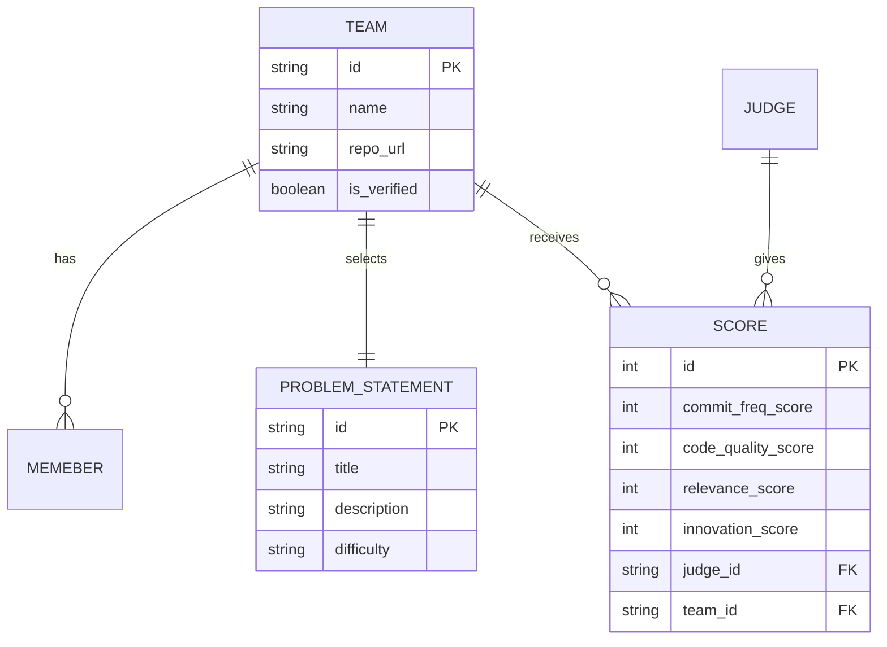

# HACKTHONIX 2.0 - Website Flow & Architecture

This document outlines the user flows, sitemap, and architectural logic for the Hackthonix 2.0 platform, designed for a high-intensity 10-hour innovation sprint.

## 1. User Roles & Permissions

| Role | Access Level | Key Capabilities |
| :--- | :--- | :--- |
| **Participant (Team)** | User | Register, Login, Select Problem Statement (PS), Submit GitHub Repo, View Dashboard. |
| **Judge** | Evaluator | View assigned teams, Evaluate based on 4 criteria, View live commit history. |
| **Admin** | Superuser | Manage Users/Teams, Edit PS, Override locks, View global stats, Declare results. |

## 2. Sitemap

- **Public Pages**
    - `/` (Landing Page via `www.kdkce.edu.in` / microsite)
    - `/register` (Team Registration)
    - `/login` (Team & Staff Login)
    - `/rules` (Rulebook & FAQs)

- **Participant Portal (`/dashboard`)**
    - `/dashboard` (Main Hub: Timer, PS Selection, Repo Submission)
    - `/dashboard/profile` (Team Profile)

- **Judge Portal (`/judge`)**
    - `/judge/dashboard` (List of assigned teams)
    - `/judge/evaluate/:teamId` (Scoring Interface)

- **Admin Portal (`/admin`)**
    - `/admin/dashboard` (Live Event Monitor)
    - `/admin/teams` (Team Management)
    - `/admin/problems` (PS Management)

## 3. Core User Flows

### A. Team Registration & Onboarding
1.  **Landing Page**: User clicks "Register".
2.  **Registration Form**:
    - Enter Team Name (Unique).
    - Enter Member Details (Name, Email, Contact) for 2-4 members.
    - Submit -> **Account Created** (No password flow for speed, or simple team-code based auth).
3.  **Onboarding**: Redirect to Dashboard.

### B. Event Kickoff & PS Selection
1.  **Dashboard Access**: Team logs in.
2.  **Problem Statement (PS) Grid**:
    - View 12 available PS cards (Title, Difficulty, Tags).
    - Click to expand details.
3.  **Selection w/ Lock-in Logic**:
    - Click "Select Problem".
    - **Timer Starts**: 10-minute countdown to confirm or change.
    - **Action**: Can switch PS within 10 mins.
    - **Lock**: After 10 mins OR manual "Final Lock", the PS is permanently assigned.

### C. Development & Tracking Loop
1.  **Repo Submission**: Team submits GitHub Repository URL in Dashboard.
2.  **Automated Tracking**:
    - System polls GitHub API every 5 minutes.
    - Updates "Commit Frequency" graph on Judge/Admin dashboard.
3.  **Live Dashboard**: Shows "Time Remaining" and "System Status".

### D. Judging Process
1.  **Judge Login**: Access via secure credentials.
2.  **Evaluation Dashboard**: See list of teams.
3.  **Scoring (`/judge/evaluate/:teamId`)**:
    - View Team's PS and GitHub Link.
    - Score on 4 Criteria (0-25 each):
        1.  Commit Frequency (Automated/Visual).
        2.  Code Quality.
        3.  Problem Relevance.
        4.  Final Submission.
    - Submit Score -> Score is frozen (editable only by Admin).

## 4. Visual Diagrams

### Overall System Flow

### Problem Statement Selection Logic

### Data Architecture (Simplified)

## 5. Visuals & Animation Strategy

### Design Philosophy: "Cyber-Obsidian"
To match the high-intensity innovation sprint, the visual language will be dark, futuristic, and premium.

- **Theme**: Ultra-dark mode with neon accents (Cyan, Purple, Electric Blue).
- **Surface Materials**:
  - **Glassmorphism**: Frosted glass cards for transparency and depth.
  - **Obsidian**: Deep blacks (`#050505`) for backgrounds to make content pop.
  - **Metallic Gradients**: Subtle silver/steel gradients for borders and primary actions.

### Animation Layer (Framer Motion)
1.  **Hero Section**:
    - **Glitch Effect**: Text entrance animations.
    - **Particle Background**: Interactive constellation or matrix rain effect.
2.  **Page Transitions**:
    - Smooth dissolve/slide transitions between Dashboard and other pages.
    - **Shared Layout Animations**: Cards expanding from grid to detail view (PS Selection).
3.  **Micro-Interactions**:
    - **Buttons**: Glow on hover, magnetic pull effect.
    - **Countdown Timer**: Pulse effect as time runs low (last 1 minute).
    - **Progress Bars**: Smooth filling animations for commit tracking.

### Typography
- **Headings**: `Outfit` or `Syncopate` (Wide, bold, futuristic).
- **Body**: `Inter` or `Space Grotesk` (Clean, legible, tech-oriented).

### Key Visual Components
- **Neon Borders**: Accents on active cards (e.g., Selected Problem Statement).
- **Holographic Badges**: For "Winner" or "Leaderboard" ranks.
- **Live Activity Pulse**: Green pulsing dots for active team commits.
